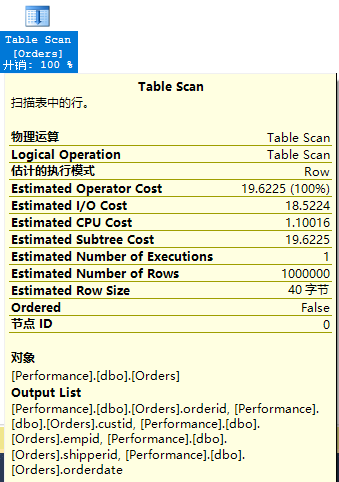
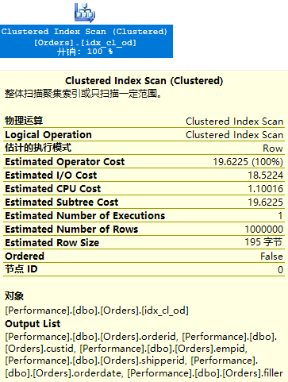
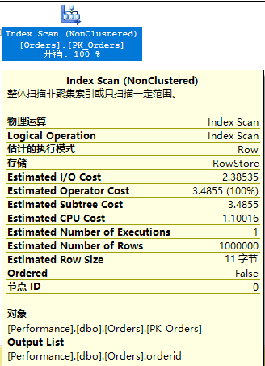
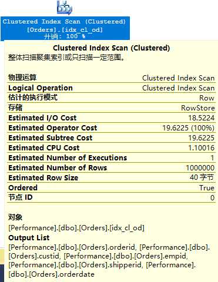
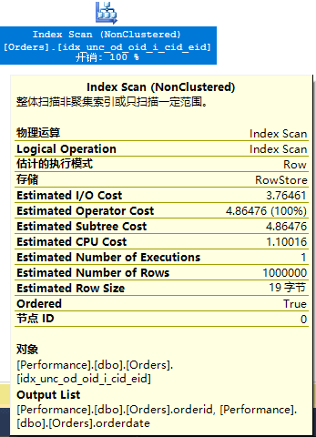

- 逻辑查询顺序
  - FROM FROM阶段标识出查询的来源表,处理表运算符.每个表运算符也会应用一系列子阶段.例如,在联接运算中涉及的阶段是(1-J1)笛卡尔积、(1-J2)ON筛选器和(1-J3)添加外部行.FROM阶段生成虚拟表VT1
    - (1-J1)笛卡尔积 这个阶段对表运算符涉及的两个表执行笛卡尔积(交叉联接),生成虚拟表VT1-J1
    - (1-J2)ON筛选器 这个阶段对VT1-J1中的行根据ON子句中出现的谓词进行筛选.只有让该谓词取值为TRUE的行,才能插入VT1-J2
    - (1-J3)添加外部行 如果指定了OUTER JOIN(INNER JOIN、CROSS JOIN),则将保留表中没有找到匹配的行,作为外部行添加到VT1-J2,生成VT1-J3
  - WHERE 这个阶段根据在WHERE子句中出现的谓词对VT1中的行进行筛选.只有让谓词计算结果为TRUE的行,才会插入VT2中.
  - GROUP BY 按照GROUP BY子句中指定的列名列表,将VT2中的行进行分组,生成VT3.最终,每个分组只有一个结果行.
  - HAVING 根据HAVING子句中出现的谓词对VT3中的分组进行筛选.只有让谓词计算结果为TRUE的组,才会插入到VT4.
  - SELECT 处理SELECT子句中的元素,产生VT5.
    - 计算表达式 计算SELECT列表中的表达式,生成VT5-1
    - DISTINCT 删除VT5-1中的重复行,生成VT5-2
    - TOP 根据ORDER BY子句定义的逻辑排序,从VT5-2中选择前面指定数量或百分比行,生成表VT5-3
  - ORDER BY 根据ORDER BY子句中指定的列名列表,对VT5-3中的行进行排序,生成游标VC6

  ```sql
  SELECT
  	c.customerid,
  	COUNT(o.orderid) AS numorders
  FROM
  	dbo.Customers AS C
  LEFT OUTER JOIN
  	dbo.Orders AS O
  ON
  	C.customerid=O.customerid
  WHERE
  		C.city='Madrid'
  GROUP BY
  	C.customerid
  HAVING
  	COUNT(O.orderid)<3
  ORDER BY
  	numorders
  ```

***
- I/O通常是数据处理操作所涉及的最昂贵的资源,而且,当查询或索引没有良好地设计或优化时,结果一般会造成大量的I/O.
- 网络相关的等待(例如:ASYNC_NETWORK_IO),它们的值过高,则表明可能存在网络问题,也可能表明客户端没有足够快地使用SQL Server发送给它的数据.
- 查询优化
  - 优化方法论
    - 分析实例级别的等待
      -
      ```SQL
      SELECT
      wait_type,				--类型
      waiting_tasks_count,	--该类等待的数量
      wait_time_ms,			--以毫秒为单位的该类等待的总等待时间(该时间包含signal_wait_time_ms)
      max_wait_time_ms,
      signal_wait_time_ms		--正在等待的线程从收到信号通知到其开始运行之间的时差
      FROM
      sys.dm_os_wait_stats
      ORDER BY
      wait_type
      ```

    - 关联等待和队列
      - 性能计数器
      ```SQL
      SELECT
      object_name,
      counter_name,
      instance_name,
      cntr_value,
      cntr_type
      FROM
      sys.dm_os_performance_counters
      ```

    - 确定方案
    - 细化到数据库/文件级
    - 细化到进程级
    - 优化索引/查询


---
#### DBCC
- 清空缓存中所有数据
  ```SQL
  DBCC DROPCLEANBUFFERS
  ```

- 清空缓存中执行计划
  ```SQL
  DBCC FREEPROCCACHE
  ```

---
#### STATISTICS
- IO
  ```SQL
  SET STATISTICS IO ON
  --SQL语句
  SET STATISTICS IO OFF
  ```

- 查询的运行时间
  ```SQL
  SET STATISTICS TIME ON
  --SQL语句
  SET STATISTICS TIME OFF
  ```

---
#### 图形化的执行计划
  - Ctrl+L
  - Ctrl+M

---
#### 索引访问方法
- 表扫描/无序聚集索引扫描
  - 对属于表的所有数据页进行扫描.
  - 优化器在执行计划中给出一条执行表扫描的指令,存储引擎只能以一种方式来执行该指令:使用分配顺序扫描
  - SQL Server使用表的IAM页,按分区的文件顺寻来扫描属于该表的各个区.
  - 逻辑读取次数应该等于该表使用的页数
  ```SQL
  SELECT
    orderid,custid,empid,shipperid,orderdate
  FROM
    dbo.Orders
  ```
  

 - SQL Server 执行时间:
   CPU 时间 = 719 毫秒，占用时间 = 10188 毫秒。

 - 表 'Orders'。扫描计数 1，逻辑读取 25002 次，物理读取 0 次，预读 25002 次，lob 逻辑读取 0 次，lob 物理读取 0 次，lob 预读 0 次。

---
##### 聚集索引
  ```SQL
  CREATE CLUSTERED INDEX idx_cl_od ON dbo.Orders(orderdate)
  ```

- 无序聚集索引扫描(Clustered Index Scan运算符,其中Ordered属性为False)
  - 存储引擎可以自由地从两种扫描方式中选择一种:索引或分配顺序扫描
  - 索引顺序扫描:沿链表扫描索引的叶级页
  - 分配顺序扫描:根据IAM页进行扫描

  

  -   SQL Server 执行时间:
   CPU 时间 = 875 毫秒，占用时间 = 9262 毫秒。
  - 表 'Orders'。扫描计数 1，逻辑读取 25084 次，物理读取 1 次，预读 1294 次，lob 逻辑读取 0 次，lob 物理读取 0 次，lob 预读 0 次。

---
- 无序覆盖非聚集索引扫描
  - 类似于无序聚集索引扫描
  - 覆盖索引:非聚集索引包含在查询中指定的所有列中.
  ```SQL
  SELECT orderid FROM dbo.Orders
  ```

  

  -  SQL Server 执行时间:
   CPU 时间 = 297 毫秒，占用时间 = 6268 毫秒。
  - 表 'Orders'。扫描计数 1，逻辑读取 3227 次，物理读取 0 次，预读 22 次，lob 逻辑读取 0 次，lob 物理读取 0 次，lob 预读 0 次。


---
- 有序聚集索引扫描
  - 对聚集索引的叶级执行的一种完整扫描,可以确保按索引顺序为下一个运算符返回数据.
  - 当运算符具有:Ordered:True,存储引擎只能以一种方式来执行扫描:通过索引顺序扫描(基于索引链表的扫描)
  - 索引有序扫描的性能取决于索引的碎片级别
    - 没有碎片,索引顺序扫描的性能应该非常接近于分配顺序扫描的性能,因为二者最终会按文件顺序连续地读取数据.
    - 碎片级数越来越高,分配顺序扫描地性能更高.
  ```SQL
  SELECT orderid,custid,empid,shipperid,orderdate FROM dbo.Orders ORDER BY orderdate
  ```

  
  -  SQL Server 执行时间:
   CPU 时间 = 969 毫秒，占用时间 = 9714 毫秒。
  - 表 'Orders'。扫描计数 1，逻辑读取 25084 次，物理读取 1 次，预读 1294 次，lob 逻辑读取 0 次，lob 物理读取 0 次，lob 预读 0 次。


---
- 有序覆盖非聚集索引扫描
  ```SQL
  SELECT orderid,orderdate FROM dbo.Orders ORDER BY orderdate
  ```

  -   SQL Server 执行时间:
   CPU 时间 = 438 毫秒，占用时间 = 7029 毫秒。
  - 表 'Orders'。扫描计数 1，逻辑读取 5097 次，物理读取 0 次，预读 12 次，lob 逻辑读取 0 次，lob 物理读取 0 次，lob 预读 0 次。你


---
#### 存储引擎的扫描处理
- 当执行计划显示了一个Table Scan运算符时,存储引擎只能有一个选择:使用分配顺序扫描
- 当执行计划显示了一个Index Scan运算符(聚集或非聚集),而且具有属性Ordered:True时,存储引擎也只能使用索引顺序扫描.
- 就性能来说,存储引擎会优先选择分配顺序扫描.
- 当索引非常小(最多64页)时,存储引擎会优先选择索引顺序扫描.
- 由于在扫描期间发生页拆分,分配顺序扫描可能在结果中多次返回某些行,也可能忽略掉某些行.插入一个新行,对索引键进行更新都可能导致拆分,让行发生移动;对可变长度的列进行更新,也可能导致页拆分,对行进行扩展.记住,拆分只在索引页中进行,堆中的页不会发生拆分.
- 分配顺序扫描容易由于页拆分而进行不一致的读取,而索引顺序扫描则不会.
